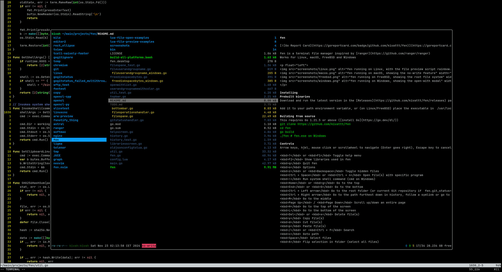

This NeoVim plugin embeds [fen](https://github.com/kivattt/fen) file manager, and lets you open files in new tabs

This plugin works with fen v1.7.18 or above



## Installation
[vim-plug](https://github.com/junegunn/vim-plug):
```lua
Plug("kivattt/fen.nvim")

local fen = require("fen")
vim.keymap.set("n", "<Leader>f", fen.show)
```

## Configuration (defaults)
```lua
local fen = require("fen")
fen.setup({
    border = "rounded", -- See: https://neovim.io/doc/user/api.html#:~:text=border%3A
    title = "FEN", -- Terminal title (buffer name)
    disable_no_write = false -- Set this to true to allow deleting or modifying files
})
```

## TODO
- Disable search highlighting for the fen popup window\
- Center the popup window
